# soal-shift-sisop-modul-4-IT13-2021
### <b> Nama Anggota Kelompok: </b>
#### 1. Asiyah Hanifah (05311940000002)
#### 2. Muhammad Yasykur Rafii (05311940000017)
#### 3. Christopher Adrian Kusuma (05311940000022)
---

## Soal 1

Di suatu jurusan, terdapat admin lab baru yang super duper gabut, ia bernama Sin. Sin baru menjadi admin di lab tersebut selama 1 bulan. Selama sebulan tersebut ia bertemu orang-orang hebat di lab tersebut, salah satunya yaitu Sei. Sei dan Sin akhirnya berteman baik. Karena belakangan ini sedang ramai tentang kasus keamanan data, mereka berniat membuat filesystem dengan metode encode yang mutakhir. Berikut adalah filesystem rancangan Sin dan Sei :</br>
</br>

<b>NOTE : </b><br> 
Semua file yang berada pada direktori harus ter-encode menggunakan Atbash cipher(mirror).
Misalkan terdapat file bernama kucinglucu123.jpg pada direktori DATA_PENTING
“AtoZ_folder/DATA_PENTING/kucinglucu123.jpg” → “AtoZ_folder/WZGZ_KVMGRMT/pfxrmtofxf123.jpg”

<b>NOTE : </b><br> 
filesystem berfungsi normal layaknya linux pada umumnya, Mount source (root) filesystem adalah directory /home/[USER]/Downloads, dalam penamaan file ‘/’ diabaikan, dan ekstensi tidak perlu di-encode.
Referensi : https://www.dcode.fr/atbash-cipher<br>

(a) Jika sebuah direktori dibuat dengan awalan “AtoZ_”, maka direktori tersebut akan menjadi direktori ter-encode. </br>

(b) Jika sebuah direktori di-rename dengan awalan “AtoZ_”, maka direktori tersebut akan menjadi direktori ter-encode. </br>

(c) Apabila direktori yang terenkripsi di-rename menjadi tidak ter-encode, maka isi direktori tersebut akan terdecode. </br>

(d) Setiap pembuatan direktori ter-encode (mkdir atau rename) akan tercatat ke sebuah log. Format : /home/[USER]/Downloads/[Nama Direktori] → /home/[USER]/Downloads/AtoZ_[Nama Direktori] </br>

(e) Metode encode pada suatu direktori juga berlaku terhadap direktori yang ada di dalamnya.(rekursif) </br>

(f) Client dapat melihat semua isi files.tsv dengan memanggil suatu perintah yang bernama see. Output dari perintah tersebut keluar dengan format. 

## Penyelesaian:
### Code:
```c
void atbash(char *name) {
    if (strcmp(name, ".") == 0 || strcmp(name, "..") == 0) return;

    char *dot = strrchr(name, '.');
    char *atoz = strstr(name, "AtoZ_");
    int i;
    for (i = atoz - name; i < strlen(name); ++i) {
        if (name[i] == '/') {
            break;
        }
    }

    if (atoz == NULL) {
        i = 0;
    }

    int last = dot ? dot - name: strlen(name);
    for (; i < last; ++i) {
        if ('A' <= name[i] && name[i] <= 'Z') {
            name[i] = 155 - name[i];
        } else if ('a' <= name[i] && name[i] <= 'z') {
            name[i] = 219 - name[i];
        }
    }
}

void rot13(char *name) {
    if (strcmp(name, ".") == 0 || strcmp(name, "..") == 0) return;

    int name_len = strlen(name);
    for (int i = 0; i < name_len; ++i) {
        if ('A' <= name[i] && name[i] <= 'M') {
            name[i] = 13 + name[i];
        } else if ('N' <= name[i] && name[i] <= 'Z') {
            name[i] = -13 + name[i];
        } else if ('a' <= name[i] && name[i] <= 'm') {
            name[i] = 13 + name[i];
        } else if ('n' <= name[i] && name[i] <= 'z') {
            name[i] = -13 + name[i];
        }
    }

    char *dot = strrchr(name, '.');
    for (int i = (int)(dot - name); i < name_len; ++i) {
        if ('A' <= name[i] && name[i] <= 'M') {
            name[i] = 13 + name[i];
        } else if ('N' <= name[i] && name[i] <= 'Z') {
            name[i] = -13 + name[i];
        } else if ('a' <= name[i] && name[i] <= 'm') {
            name[i] = 13 + name[i];
        } else if ('n' <= name[i] && name[i] <= 'z') {
            name[i] = -13 + name[i];
        }
    }
}

void vigenere_enc(char *name) {
    char *key = "SISOP";

    if (strcmp(name, ".") == 0 || strcmp(name, "..") == 0) return;

    int n = 0;

    char *dot = strrchr(name, '.');
    for (int i = 0; i < (int)(dot - name); ++i) {
        if ('A' <= name[i] && name[i] <= 'Z') {
            name[i] = 65 + (name[i] + key[n] - 130) % 26;
            n = (n + 1) % 5;
        } else if ('a' <= name[i] && name[i] <= 'z') {
            name[i] = 97 + (name[i] + key[n] - 162) % 26;
            n = (n + 1) % 5;
        }
    }
}

void vigenere_dec(char *name) {
    char *key = "SISOP";

    if (strcmp(name, ".") == 0 || strcmp(name, "..") == 0) return;

    int n = 0;

    char *dot = strrchr(name, '.');
    for (int i = 0; i < (int)(dot - name); ++i) {
        if ('A' <= name[i] && name[i] <= 'Z') {
            name[i] = 65 + (name[i] - key[n] + 26) % 26;
            n = (n + 1) % 5;
        } else if ('a' <= name[i] && name[i] <= 'z') {
            name[i] = 97 + (name[i] - key[n] - 6) % 26;
            n = (n + 1) % 5;
        }
    }

}

void check_encryption(char *path, const char *fpath) {
    printf("check %s %s\n", path, fpath);
    if (strstr(fpath, "/AtoZ_") != NULL) {
        atbash(path);
    } else if (strstr(fpath, "/RX_") != NULL) {
        atbash(path);
        rot13(path);
    }
    printf("enc %s\n", path);
}


static int xmp_getattr(const char *path, struct stat *st) {
    char fpath[2000], name[1000], temp[1000];
    sprintf(temp, "%s", path);

    int name_len = strlen(path);
    for (int i = 0; i < name_len; i++) {
        name[i] = path[i + 1];
    }
    printf("getattr %s\n", name);
    
    // vigenere_dec(name);
    // atbash(name);
    // rot13(name);
    check_encryption(temp, path);
    sprintf(fpath, "%s/%s", dirpath, temp);
    
    int res = lstat(fpath, st);
    if (res != 0){
        return -ENOENT;
    }

    return 0;
}

static int xmp_readdir(const char *path, void *buf, fuse_fill_dir_t filler, off_t offset, struct fuse_file_info *fi) {
    int res;
    DIR *dp;
    struct dirent *de;

    (void) offset;
    (void) fi;
    char fpath[2000];
    char name[1000];

    if (strcmp(path, "/") == 0) {
        sprintf(fpath, "%s", dirpath);
    } 
    else {
        sprintf(name, "%s", path);
        // vigenere_dec(name);
        // atbash(name);
        // rot13(name);
        check_encryption(name, path);
        sprintf(fpath, "%s/%s", dirpath, name);
    }

    printf("readdir: %s\n", fpath);

    dp = opendir(fpath);
    if (dp == NULL)
        return -errno;

    while ((de = readdir(dp)) != NULL) {
        struct stat st;
        memset(&st, 0, sizeof(st));
        st.st_ino = de->d_ino;
        st.st_mode = de->d_type << 12;

        char fullpathname[2257];
        sprintf(fullpathname, "%s/%s", fpath, de->d_name);
        
        char temp[1000];
        strcpy(temp, de->d_name);
        // vigenere_enc(temp);
        // atbash(name);
        // rot13(name);
        check_encryption(temp, fpath);

        res = (filler(buf, temp, &st, 0));
        if (res != 0) break;
    }

    closedir(dp);

    return 0;
}

static int xmp_read(const char *path, char *buf, size_t size, off_t offset, struct fuse_file_info *fi) {
    char fpath[2000];
    char name[1000];

    if (strcmp(path, "/") == 0) {
        sprintf(fpath, "%s", dirpath);
    } else {
        sprintf(name, "%s", path);
        // vigenere_dec(name);
        // atbash(name);
        // rot13(name);

        check_encryption(name, path);
        sprintf(fpath, "%s/%s", dirpath, name);
    }

    printf("read %s\n", fpath);
    
    int res = 0;
    int fd = 0 ;

    (void) fi;
    fd = open(fpath, O_RDONLY);
    if (fd == -1)
        return -errno;

    res = pread(fd, buf, size, offset);
    if (res == -1)
        res = -errno;

    close(fd);
    return res;
}

static int xmp_rename(const char *old, const char *new) {
    char fpath[2000];
    char name[1000];
    char new_name[1000];
    createlogrename(old, new);
    if (strcmp(old, "/") == 0) {
        sprintf(fpath, "%s", dirpath);
    } else {
        sprintf(name, "%s", old);
        // vigenere_dec(name);
        // atbash(name);
        // rot13(name);
        check_encryption(name, fpath);

        memset(fpath, 0, sizeof(fpath));
        memset(new_name, 0, sizeof(new_name));

        sprintf(fpath, "%s/%s", dirpath, name);
        sprintf(new_name, "%s/%s", dirpath, new);
    }

    printf("rename %s %s\n", fpath, new_name);

    int res = rename(fpath, new_name);
    if (res == -1) 
        return -errno;

    return 0;
}

static int xmp_mkdir(const char *path, mode_t mode) {
    printf("mkdir %s\n", path);
    createlog("mkdir", path);
    char fpath[2000];
    
    sprintf(fpath, "%s/%s", dirpath, path);
    mkdir(fpath, mode);

    return 0;
}

static int xmp_rmdir(const char *path) {
    printf("rmdir %s\n", path);
    createlog("rmdir", path);
    char fpath[2000];

    sprintf(fpath, "%s/%s", dirpath, path);
    int res = rmdir(fpath);
    if (res != 0) return -errno;

    return 0;
}

static struct fuse_operations xmp_oper = {
    .getattr    = xmp_getattr,
    .readdir    = xmp_readdir,
    .read       = xmp_read,
    .rename     = xmp_rename,
    .mkdir      = xmp_mkdir,
    .rmdir      = xmp_rmdir,
};

int main(int argc, char *argv[]) {
    umask(0);
    return fuse_main(argc, argv, &xmp_oper, NULL);
}
```
### Penjelasan Code:
1. Di sini kami membuat fungsi atbash untuk mengenkripsi direktori yang memiliki awalan AtoZ_.
Metode atbash sendiri merupakan suatu teknik enkripsi, dimana huruf alphabet disubtitusi dengan kebalikan dari abjadnya. Sehingga jika terdapat direktori yang nantinya dibuat dengan nama AtoZ_ atau direname menjadi AtoZ_ maka isi dari direktori itu akan terenkripsi. 
```c
void atbash(char *name) {
    if (strcmp(name, ".") == 0 || strcmp(name, "..") == 0) return;

    char *dot = strrchr(name, '.');
    char *atoz = strstr(name, "AtoZ_");
    int i;
    for (i = atoz - name; i < strlen(name); ++i) {
        if (name[i] == '/') {
            break;
        }
    }

    if (atoz == NULL) {
        i = 0;
    }

    int last = dot ? dot - name: strlen(name);
    for (; i < last; ++i) {
        if ('A' <= name[i] && name[i] <= 'Z') {
            name[i] = 155 - name[i];
        } else if ('a' <= name[i] && name[i] <= 'z') {
            name[i] = 219 - name[i];
        }
    }
}
```
2. Kemudian kami buat fungsi cek enkripsi untuk mengecek apakah direktori yang diinputkan terdapat nama AtoZ_ atau RX_. Jika terdapat nama AtoZ_ maka fungsi enkripsi atbash akan diterapkan pada direktori tersebut. Dan jika terdapat nama RX_ maka fungsi enkripsi rot13 dan atbash akan diterapkan pada direktori tersebut.
```c
void check_encryption(char *path, const char *fpath) {
    printf("check %s %s\n", path, fpath);
    if (strstr(fpath, "/AtoZ_") != NULL) {
        atbash(path);
    } else if (strstr(fpath, "/RX_") != NULL) {
        atbash(path);
        rot13(path);
    }
    printf("enc %s\n", path);
}
```
3. Kami membuat fungsi getatt untuk mendapatkan atribut dari file yang diminta dan menambahkan fungsi cek enkripsi juga.
```c
static int xmp_getattr(const char *path, struct stat *st) {
    char fpath[2000], name[1000], temp[1000];
    sprintf(temp, "%s", path);

    int name_len = strlen(path);
    for (int i = 0; i < name_len; i++) {
        name[i] = path[i + 1];
    }
    printf("getattr %s\n", name);
    
    // vigenere_dec(name);
    // atbash(name);
    // rot13(name);
    check_encryption(temp, path);
    sprintf(fpath, "%s/%s", dirpath, temp);
    
    int res = lstat(fpath, st);
    if (res != 0){
        return -ENOENT;
    }

    return 0;
}
```
4. Setelah itu kami membuat fungsi readdir untuk membaca direktori yang diminta. Fungsi ini juga menambahkan fungsi cek enkripsi yang didefinisikan sebelumnya untuk mengecek nama direktori yang akan dienkripsi.
```c
static int xmp_readdir(const char *path, void *buf, fuse_fill_dir_t filler, off_t offset, struct fuse_file_info *fi) {
    int res;
    DIR *dp;
    struct dirent *de;

    (void) offset;
    (void) fi;
    char fpath[2000];
    char name[1000];

    if (strcmp(path, "/") == 0) {
        sprintf(fpath, "%s", dirpath);
    } 
    else {
        sprintf(name, "%s", path);
        // vigenere_dec(name);
        // atbash(name);
        // rot13(name);
        check_encryption(name, path);
        sprintf(fpath, "%s/%s", dirpath, name);
    }

    printf("readdir: %s\n", fpath);

    dp = opendir(fpath);
    if (dp == NULL)
        return -errno;

    while ((de = readdir(dp)) != NULL) {
        struct stat st;
        memset(&st, 0, sizeof(st));
        st.st_ino = de->d_ino;
        st.st_mode = de->d_type << 12;

        char fullpathname[2257];
        sprintf(fullpathname, "%s/%s", fpath, de->d_name);
        
        char temp[1000];
        strcpy(temp, de->d_name);
        // vigenere_enc(temp);
        // atbash(name);
        // rot13(name);
        check_encryption(temp, fpath);

        res = (filler(buf, temp, &st, 0));
        if (res != 0) break;
    }

    closedir(dp);

    return 0;
}
```
4. kemudian kami membuat fungsi read untuk mendapat data dari file yang dibuka. Fungsi ini juga menambahkan fungsi cek enkripsi yang didefinisikan sebelumnya untuk mengecek nama direktori yang akan dienkripsi.
```c
static int xmp_read(const char *path, char *buf, size_t size, off_t offset, struct fuse_file_info *fi) {
    char fpath[2000];
    char name[1000];

    if (strcmp(path, "/") == 0) {
        sprintf(fpath, "%s", dirpath);
    } else {
        sprintf(name, "%s", path);
        // vigenere_dec(name);
        // atbash(name);
        // rot13(name);

        check_encryption(name, path);
        sprintf(fpath, "%s/%s", dirpath, name);
    }

    printf("read %s\n", fpath);
    
    int res = 0;
    int fd = 0 ;

    (void) fi;
    fd = open(fpath, O_RDONLY);
    if (fd == -1)
        return -errno;

    res = pread(fd, buf, size, offset);
    if (res == -1)
        res = -errno;

    close(fd);
    return res;
}
```
5. Kami membuat fungsi rename untuk merename folder sebelumnya menjadi nama folder yang diinginkan. Fungsi ini juga menambahkan fungsi cek enkripsi yang didefinisikan sebelumnya untuk mengecek nama direktori yang akan dienkripsi. Selain itu, fungsi ini akan menambahkan fungsi createlogrename untuk dicatat dalam log. Fungsi ini akan dijelaskan lebih lanjut di no.4.
```c
static int xmp_rename(const char *old, const char *new) {
    char fpath[2000];
    char name[1000];
    char new_name[1000];
    createlogrename(old, new);
    if (strcmp(old, "/") == 0) {
        sprintf(fpath, "%s", dirpath);
    } else {
        sprintf(name, "%s", old);
        // vigenere_dec(name);
        // atbash(name);
        // rot13(name);
        check_encryption(name, fpath);

        memset(fpath, 0, sizeof(fpath));
        memset(new_name, 0, sizeof(new_name));

        sprintf(fpath, "%s/%s", dirpath, name);
        sprintf(new_name, "%s/%s", dirpath, new);
    }

    printf("rename %s %s\n", fpath, new_name);

    int res = rename(fpath, new_name);
    if (res == -1) 
        return -errno;

    return 0;
}
```
6. Kemudian kami membuat fungsi mkdir. Fungsi ini digunakan untuk membuat folder yang diinginkan. kemudian aktifitas ini dicatat dalam log dengan fungsi createlog yang akan dijelaskan lebih lanjut di no.4.
```c
static int xmp_mkdir(const char *path, mode_t mode) {
    printf("mkdir %s\n", path);
    createlog("mkdir", path);
    char fpath[2000];
    
    sprintf(fpath, "%s/%s", dirpath, path);
    mkdir(fpath, mode);

    return 0;
}
```
7. Kami juga membuat fungsi rmdir untuk menghapus direktori. kemudian aktifitas ini dicatat dalam log dengan fungsi createlog yang akan dijelaskan lebih lanjut di no.4.
```c
static int xmp_rmdir(const char *path) {
    printf("rmdir %s\n", path);
    createlog("rmdir", path);
    char fpath[2000];

    sprintf(fpath, "%s/%s", dirpath, path);
    int res = rmdir(fpath);
    if (res != 0) return -errno;

    return 0;
}
```
## Kendala yang Dihadapi: 
Program ini berjalan dengan baik untuk semua folder yang terdapat nama AtoZ_ namun jika dalam folder AtoZ_ terdapat folder AtoZ_ juga program ini belum bisa berjalan.
## Screeshoot Hasil:
1. Menjalankan program. Garis besarnya nantinya terdapat folder bernama halo yang belum diisi apapun, kemudian ketika program mulai dijalankan, Mount source (root) filesystem dari folder halo ini adalah directory /home/[USER]/Downloads.
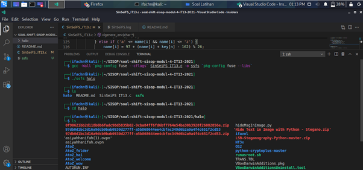

2. Kemudian membuat folder AtoZ_hore yang didalamnya dibuat folder lagi yang bernama halo dan gais.
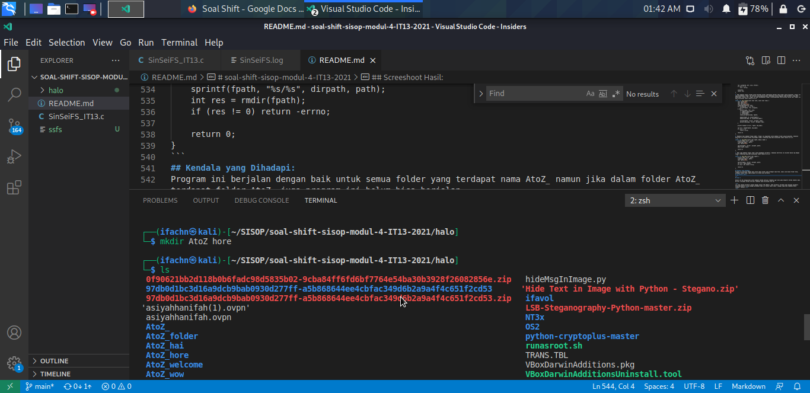
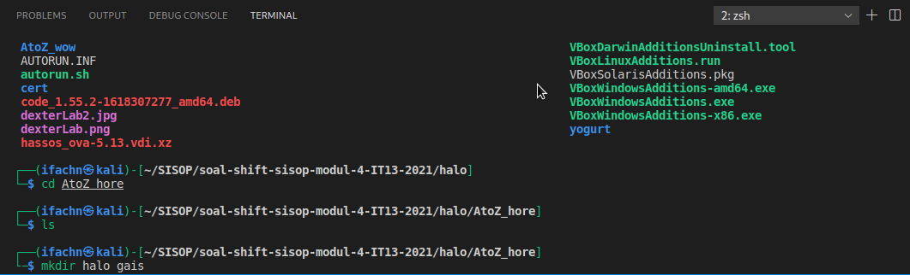

3. Setelah itu dicek kembali apakah folder AtoZ_hore ini dalamnya terenkripsi. Dan dapat dilihat dari folder yang bernama halo dan gais menjadi folder yang namanya terenkripsi seperti yang ada di bawah ini.
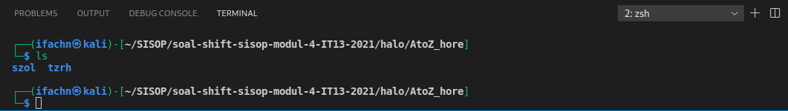

4. Kemudian merename folder yang bernama yogurt menjadi Atoz_yogurt untuk menyelesaikan soal 1 b. kemudian dicek apakah isi dari direktori yang sebelumnya normal(belum dienkripsi) menjadi terenkripsi
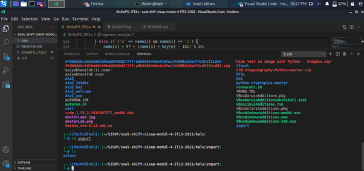
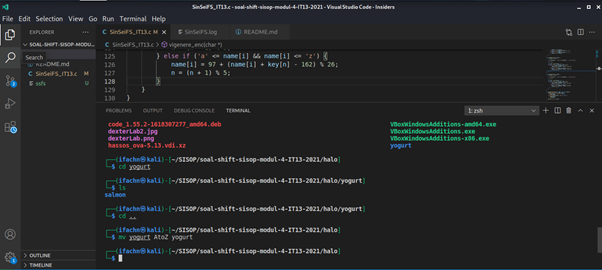
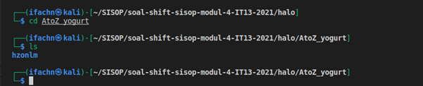

5. Setelah itu, kami mencoba untuk merename kembali folder Atoz_yogurt menjadi yogurt. Kemudian isi dari folder Atoz_yogurt yang sebelumnya dienkripsi ini menjadi dekripsi setelah namanya kembali seperti semula.
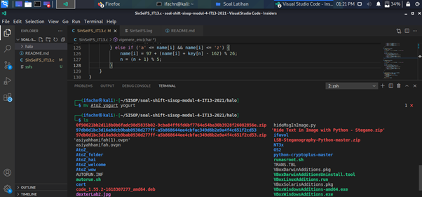
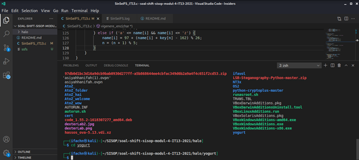
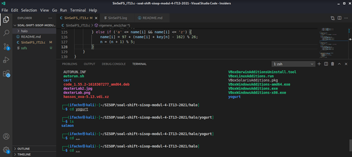

6. Setelah itu program diumount kembali.
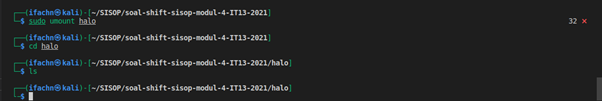
---
## Soal 2

Selain itu Sei mengusulkan untuk membuat metode enkripsi tambahan agar data pada komputer mereka semakin aman. Berikut rancangan metode enkripsi tambahan yang dirancang oleh Sei

</br>
(a) Jika sebuah direktori dibuat dengan awalan “RX_[Nama]”, maka direktori tersebut akan menjadi direktori terencode beserta isinya dengan perubahan nama isi sesuai kasus nomor 1 dengan algoritma tambahan ROT13 (Atbash + ROT13).</br>
</br>
(b) Jika sebuah direktori di-rename dengan awalan “RX_[Nama]”, maka direktori tersebut akan menjadi direktori terencode beserta isinya dengan perubahan nama isi sesuai dengan kasus nomor 1 dengan algoritma tambahan Vigenere Cipher dengan key “SISOP” (Case-sensitive, Atbash + Vigenere).</br>
</br>
(c) Apabila direktori yang terencode di-rename (Dihilangkan “RX_” nya), maka folder menjadi tidak terencode dan isi direktori tersebut akan terdecode berdasar nama aslinya. </br>
</br>
(d) Setiap pembuatan direktori terencode (mkdir atau rename) akan tercatat ke sebuah log file beserta methodnya (apakah itu mkdir atau rename).</br>
</br>
(e) Pada metode enkripsi ini, file-file pada direktori asli akan menjadi terpecah menjadi file-file kecil sebesar 1024 bytes, sementara jika diakses melalui filesystem rancangan Sin dan Sei akan menjadi normal. Sebagai contoh, Suatu_File.txt berukuran 3 kiloBytes pada directory asli akan menjadi 3 file kecil yakni:
</br>
</br>
Suatu_File.txt.0000
</br>
Suatu_File.txt.0001
</br>
Suatu_File.txt.0002
</br></br>
Ketika diakses melalui filesystem hanya akan muncul Suatu_File.txt
</br>

## Penyelesaian:
### Code:
```c
void rot13(char *name) {
    if (strcmp(name, ".") == 0 || strcmp(name, "..") == 0) return;

    int name_len = strlen(name);
    for (int i = 0; i < name_len; ++i) {
        if ('A' <= name[i] && name[i] <= 'M') {
            name[i] = 13 + name[i];
        } else if ('N' <= name[i] && name[i] <= 'Z') {
            name[i] = -13 + name[i];
        } else if ('a' <= name[i] && name[i] <= 'm') {
            name[i] = 13 + name[i];
        } else if ('n' <= name[i] && name[i] <= 'z') {
            name[i] = -13 + name[i];
        }
    }

    char *dot = strrchr(name, '.');
    for (int i = (int)(dot - name); i < name_len; ++i) {
        if ('A' <= name[i] && name[i] <= 'M') {
            name[i] = 13 + name[i];
        } else if ('N' <= name[i] && name[i] <= 'Z') {
            name[i] = -13 + name[i];
        } else if ('a' <= name[i] && name[i] <= 'm') {
            name[i] = 13 + name[i];
        } else if ('n' <= name[i] && name[i] <= 'z') {
            name[i] = -13 + name[i];
        }
    }
}

void vigenere_enc(char *name) {
    char *key = "SISOP";

    if (strcmp(name, ".") == 0 || strcmp(name, "..") == 0) return;

    int n = 0;

    char *dot = strrchr(name, '.');
    for (int i = 0; i < (int)(dot - name); ++i) {
        if ('A' <= name[i] && name[i] <= 'Z') {
            name[i] = 65 + (name[i] + key[n] - 130) % 26;
            n = (n + 1) % 5;
        } else if ('a' <= name[i] && name[i] <= 'z') {
            name[i] = 97 + (name[i] + key[n] - 162) % 26;
            n = (n + 1) % 5;
        }
    }
}

void vigenere_dec(char *name) {
    char *key = "SISOP";

    if (strcmp(name, ".") == 0 || strcmp(name, "..") == 0) return;

    int n = 0;

    char *dot = strrchr(name, '.');
    for (int i = 0; i < (int)(dot - name); ++i) {
        if ('A' <= name[i] && name[i] <= 'Z') {
            name[i] = 65 + (name[i] - key[n] + 26) % 26;
            n = (n + 1) % 5;
        } else if ('a' <= name[i] && name[i] <= 'z') {
            name[i] = 97 + (name[i] - key[n] - 6) % 26;
            n = (n + 1) % 5;
        }
    }

}

void check_encryption(char *path, const char *fpath) {
    printf("check %s %s\n", path, fpath);
    if (strstr(fpath, "/AtoZ_") != NULL) {
        atbash(path);
    } else if (strstr(fpath, "/RX_") != NULL) {
        atbash(path);
        rot13(path);
    }
    printf("enc %s\n", path);
}
```
### Penjelasan Code:
1. Kami membuat fungsi rot13 agar setiap direktori yang diwali “RX_[Nama]”, maka isi dari direktori akan terencode dengan algoritma tambahan ROT13 (Atbash + ROT13).
```c
void rot13(char *name) {
    if (strcmp(name, ".") == 0 || strcmp(name, "..") == 0) return;

    int name_len = strlen(name);
    for (int i = 0; i < name_len; ++i) {
        if ('A' <= name[i] && name[i] <= 'M') {
            name[i] = 13 + name[i];
        } else if ('N' <= name[i] && name[i] <= 'Z') {
            name[i] = -13 + name[i];
        } else if ('a' <= name[i] && name[i] <= 'm') {
            name[i] = 13 + name[i];
        } else if ('n' <= name[i] && name[i] <= 'z') {
            name[i] = -13 + name[i];
        }
    }

    char *dot = strrchr(name, '.');
    for (int i = (int)(dot - name); i < name_len; ++i) {
        if ('A' <= name[i] && name[i] <= 'M') {
            name[i] = 13 + name[i];
        } else if ('N' <= name[i] && name[i] <= 'Z') {
            name[i] = -13 + name[i];
        } else if ('a' <= name[i] && name[i] <= 'm') {
            name[i] = 13 + name[i];
        } else if ('n' <= name[i] && name[i] <= 'z') {
            name[i] = -13 + name[i];
        }
    }
}
```
2. kemudian kami buat fungsi vigenere_enc untuk mengenkripsi isi dari direktori yang direname dengan awalan “RX_[Nama]” menggunakan algoritma ambahan Vigenere Cipher dengan key “SISOP” (Case-sensitive, Atbash + Vigenere).
```c
void vigenere_enc(char *name) {
    char *key = "SISOP";

    if (strcmp(name, ".") == 0 || strcmp(name, "..") == 0) return;

    int n = 0;

    char *dot = strrchr(name, '.');
    for (int i = 0; i < (int)(dot - name); ++i) {
        if ('A' <= name[i] && name[i] <= 'Z') {
            name[i] = 65 + (name[i] + key[n] - 130) % 26;
            n = (n + 1) % 5;
        } else if ('a' <= name[i] && name[i] <= 'z') {
            name[i] = 97 + (name[i] + key[n] - 162) % 26;
            n = (n + 1) % 5;
        }
    }
}
```
3. Kemudian kami buat fungsi vignere_dec untuk mendekripsi direktori yang direname menjadi tanpa “RX_”. Maka isi direktori akan terdecode
```c
void vigenere_dec(char *name) {
    char *key = "SISOP";

    if (strcmp(name, ".") == 0 || strcmp(name, "..") == 0) return;

    int n = 0;

    char *dot = strrchr(name, '.');
    for (int i = 0; i < (int)(dot - name); ++i) {
        if ('A' <= name[i] && name[i] <= 'Z') {
            name[i] = 65 + (name[i] - key[n] + 26) % 26;
            n = (n + 1) % 5;
        } else if ('a' <= name[i] && name[i] <= 'z') {
            name[i] = 97 + (name[i] - key[n] - 6) % 26;
            n = (n + 1) % 5;
        }
    }

}
```
## Kendala yang Dihadapi:
>Belum dapat mengerjakan soal nomer 2 d dan e karena anggota kelompok kami belum dapat memahami cara untuk menyelesaikan soal tersebut. Sehingga kami memutuskan untuk mengerjakan fungsi 2 a, b, dan c saja. Namun fungsi ini belum ditambahkan ke setiap syscallnya. Sehingga program belum dapat menjalankan fungsi ini.
---

## Soal 3

Karena Sin masih super duper gabut akhirnya dia menambahkan sebuah fitur lagi pada filesystem mereka. 

(a) Jika sebuah direktori dibuat dengan awalan “A_is_a_”, maka direktori tersebut akan menjadi sebuah direktori spesial.</br>

(b) Jika sebuah direktori di-rename dengan memberi awalan “A_is_a_”, maka direktori tersebut akan menjadi sebuah direktori spesial.</br>

(c) Apabila direktori yang terenkripsi di-rename dengan menghapus “A_is_a_” pada bagian awal nama folder maka direktori tersebut menjadi direktori normal.</br>

(d) Direktori spesial adalah direktori yang mengembalikan enkripsi/encoding pada direktori “AtoZ_” maupun “RX_” namun masing-masing aturan mereka tetap berjalan pada direktori di dalamnya (sifat recursive  “AtoZ_” dan “RX_” tetap berjalan pada subdirektori).</br>

(e) Pada direktori spesial semua nama file (tidak termasuk ekstensi) pada fuse akan berubah menjadi lowercase insensitive dan diberi ekstensi baru berupa nilai desimal dari binner perbedaan namanya.


Contohnya jika pada direktori asli nama filenya adalah “FiLe_CoNtoH.txt” maka pada fuse akan menjadi “file_contoh.txt.1321”. 1321 berasal dari biner 10100101001.

## Penyelesaian:


---
## Soal 4

Untuk memudahkan dalam memonitor kegiatan pada filesystem mereka Sin dan Sei membuat sebuah log system dengan spesifikasi sebagai berikut.

(a) Log system yang akan terbentuk bernama “SinSeiFS.log” pada direktori home pengguna (/home/[user]/SinSeiFS.log). Log system ini akan menyimpan daftar perintah system call yang telah dijalankan pada filesystem.</br>

(b) Karena Sin dan Sei suka kerapian maka log yang dibuat akan dibagi menjadi dua level, yaitu INFO dan WARNING.
</br>

(c) Untuk log level WARNING, digunakan untuk mencatat syscall rmdir dan unlink.</br>

(d) Sisanya, akan dicatat pada level INFO.</br>

(e) Format untuk logging yaitu:


>[Level]::[dd][mm][yyyy]-[HH]:[MM]:[SS]:[CMD]::[DESC :: DESC]

<b>Keterangan:</b>
- Level : Level logging,
- dd : 2 digit tanggal,
- mm : 2 digit bulan, 
- yyy : 4 digit tahun,
- HH : 2 digit jam (format 24 Jam),
- MM : 2 digit menit,
- SS : 2 digit detik,
- CMD : System Call yang terpanggil,
- DESC : informasi dan parameter tambahan

> INFO::28052021-10:00:00:CREATE::/test.txt
> INFO::28052021-10:01:00:RENAME::/test.txt::/rename.txt


## Penyelesaian:
### Code:
```c
// Fungsi untuk membuat log
void createlog(const char process[100], const char fpath[1000]) {
    char text[2000];
    FILE *fp = fopen("/home/ifachn/SinSeiFS.log","a");
    time_t t = time(NULL);
    struct tm tm = *localtime(&t);
    
    if (strcmp(process, "unlink") == 0) {
        sprintf(text, "WARNING::%02d%02d%04d-%02d:%02d:%02d::UNLINK::%s\n", tm.tm_mday, tm.tm_mon + 1, tm.tm_year + 1900, tm.tm_hour, tm.tm_min, tm.tm_sec, fpath);
    }
    else if (strcmp(process, "mkdir") == 0) {
        sprintf(text, "INFO::%02d%02d%04d-%02d:%02d:%02d::MKDIR::%s\n", tm.tm_mday, tm.tm_mon + 1, tm.tm_year + 1900, tm.tm_hour, tm.tm_min, tm.tm_sec, fpath);
    }
    else if (strcmp(process, "rmdir") == 0) {
        sprintf(text, "WARNING::%02d%02d%04d-%02d:%02d:%02d::RMDIR::%s\n", tm.tm_mday, tm.tm_mon + 1, tm.tm_year + 1900, tm.tm_hour, tm.tm_min, tm.tm_sec, fpath);
    }
    for (int i = 0; text[i] != '\0'; i++) {
            fputc(text[i], fp);
    }
    fclose (fp);
}

// Fungsi untuk membuat log khusus proses rename
void createlogrename(const char from[1000], const char to[1000]) {
    FILE *fp = fopen("/home/ifachn/SinSeiFS.log", "a");
    time_t t = time(NULL);
    struct tm tm = *localtime(&t);
    char text[2000];

    sprintf(text, "INFO::%02d%02d%04d-%02d:%02d:%02d::RENAME::%s::%s\n", tm.tm_mday, tm.tm_mon + 1, tm.tm_year + 1900, tm.tm_hour, tm.tm_min, tm.tm_sec, from, to);
    for (int i = 0; text[i] != '\0'; i++) {
            fputc(text[i], fp);
    }
    fclose(fp);
}
```
### Penjelasan Code:
1. Kami membuat fungsi createlog untuk mencatat proses yang telah dilakukan user sebelumnya seperti membuat atau menghapus direktori. Di sini kami membedakan levelnya. Terdapat level info dan warning. Level info dipakai untuk mencatat syscall rmdir dan unlink. Sedangkan level info untuk syscall yang lainnya.
```c
// Fungsi untuk membuat log
void createlog(const char process[100], const char fpath[1000]) {
    char text[2000];
    FILE *fp = fopen("/home/ifachn/SinSeiFS.log","a");
    time_t t = time(NULL);
    struct tm tm = *localtime(&t);
    
    if (strcmp(process, "unlink") == 0) {
        sprintf(text, "WARNING::%02d%02d%04d-%02d:%02d:%02d::UNLINK::%s\n", tm.tm_mday, tm.tm_mon + 1, tm.tm_year + 1900, tm.tm_hour, tm.tm_min, tm.tm_sec, fpath);
    }
    else if (strcmp(process, "mkdir") == 0) {
        sprintf(text, "INFO::%02d%02d%04d-%02d:%02d:%02d::MKDIR::%s\n", tm.tm_mday, tm.tm_mon + 1, tm.tm_year + 1900, tm.tm_hour, tm.tm_min, tm.tm_sec, fpath);
    }
    else if (strcmp(process, "rmdir") == 0) {
        sprintf(text, "WARNING::%02d%02d%04d-%02d:%02d:%02d::RMDIR::%s\n", tm.tm_mday, tm.tm_mon + 1, tm.tm_year + 1900, tm.tm_hour, tm.tm_min, tm.tm_sec, fpath);
    }
    for (int i = 0; text[i] != '\0'; i++) {
            fputc(text[i], fp);
    }
    fclose (fp);
}
```
2. Setelah itu kami buat fungsi createlogrename untuk proses rename
```c
// Fungsi untuk membuat log khusus proses rename
void createlogrename(const char from[1000], const char to[1000]) {
    FILE *fp = fopen("/home/ifachn/SinSeiFS.log", "a");
    time_t t = time(NULL);
    struct tm tm = *localtime(&t);
    char text[2000];

    sprintf(text, "INFO::%02d%02d%04d-%02d:%02d:%02d::RENAME::%s::%s\n", tm.tm_mday, tm.tm_mon + 1, tm.tm_year + 1900, tm.tm_hour, tm.tm_min, tm.tm_sec, from, to);
    for (int i = 0; text[i] != '\0'; i++) {
            fputc(text[i], fp);
    }
    fclose(fp);
}
```
3. fungsi createlog dan createlogrename ini ditambahkan ke setiap fungsi syscall yang dibuat. Agar semua syscall yang dilakukan oleh user dicatat dalam log yang sudah ditentukan sebelumnya.

## Screenshoot Hasil: 
1. hasil log yang tercatat setelah menjalankan fungsi syscall sebelumnya.
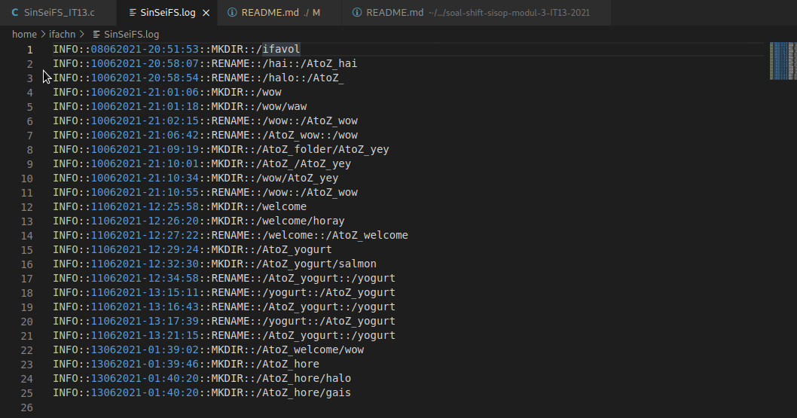
## Kendala yang Dihadapi:
tidak ada.